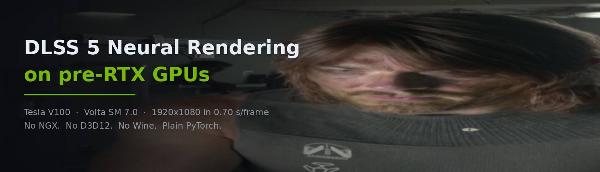
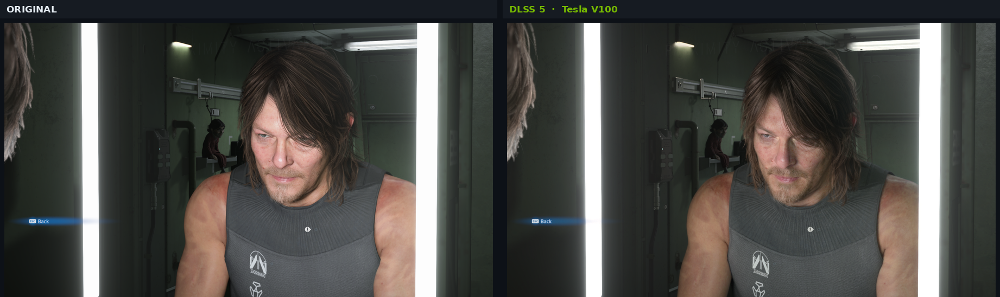
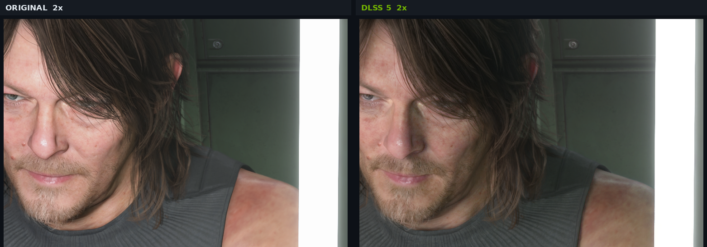
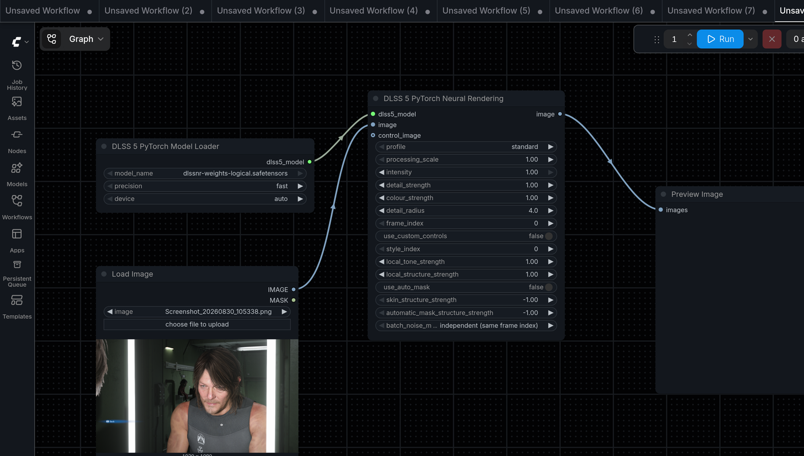
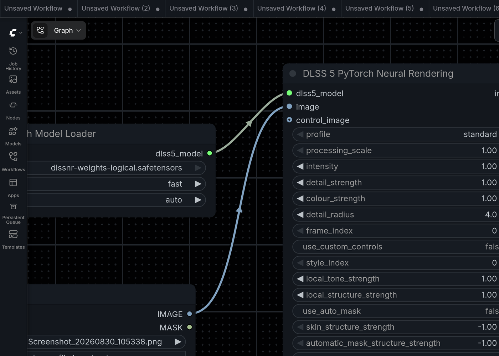
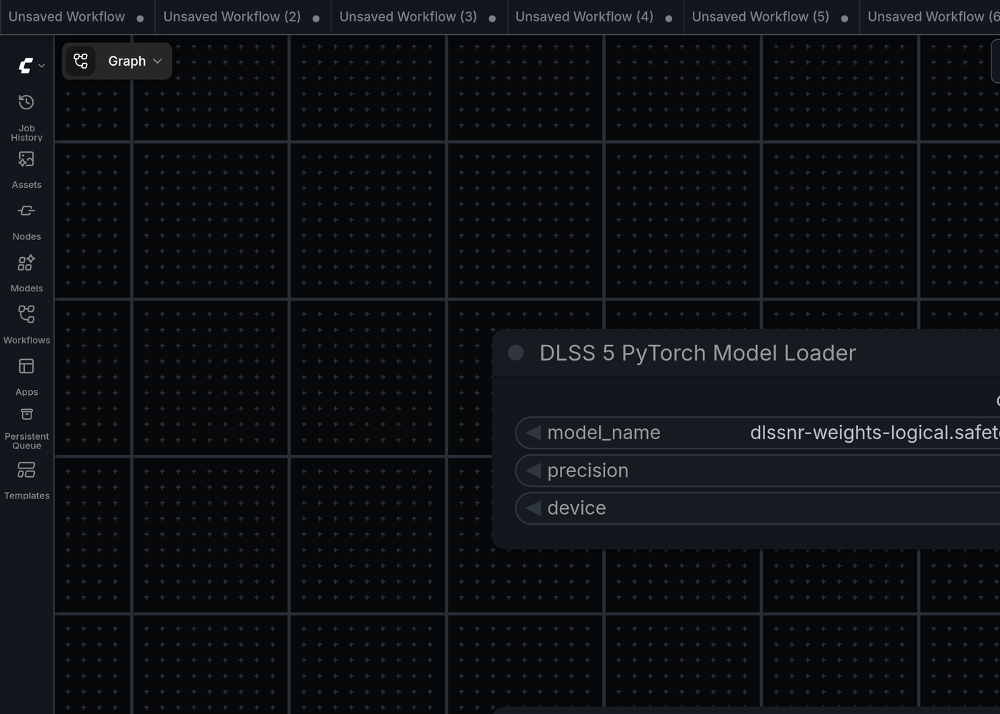
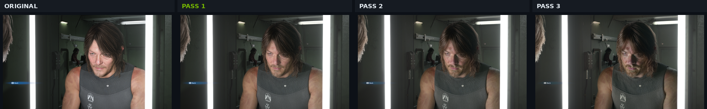

<div align="center">



# ComfyUI DLSS 5 for pre-RTX GPUs

**Run NVIDIA's DLSS 5 Neural Rendering in ComfyUI on GPUs every official plugin refuses.**

[](LICENSE)
[](#verified-hardware)
[](#how-this-works)
[](#install)
[](https://www.python.org/)

</div>

Every DLSS 5 node pack in circulation drives NVIDIA's native NGX runtime through D3D12, which
stops at Turing (RTX 20). **This one doesn't call NGX at all** — the recovered network runs as
plain PyTorch, so the architecture gate simply isn't there.

Verified end to end on a **Tesla V100-SXM2-16GB (Volta, SM 7.0)**: no RTX hardware, no NGX
support, no D3D12, no Wine.

---

## What it actually looks like

Both images below are real output from the V100 at default settings — one pass, `intensity 1.0`.
They're reproducible with the sample workflow shipped in [`examples/`](examples/).

<div align="center">



<sub><b>Left:</b> source &nbsp;·&nbsp; <b>Right:</b> DLSS 5 Neural Rendering on Tesla V100 — 1920×1080, 0.70 s</sub>

<br><br>



<sub>2× crop. The effect is material reconstruction, not sharpening: skin texture and pores are
rebuilt, hair separates into strands, micro-noise is suppressed. Full frame is unchanged in
geometry.</sub>

</div>

## In ComfyUI

<div align="center">



<sub>The pack installs under <code>DLSS 5/PyTorch (experimental)</code> — Model Loader → Neural
Rendering → Preview, fed from a normal image source.</sub>

</div>

<br>

| `DLSS5PyTorchEnhance` | `DLSS5PyTorchModelLoader` |
| :--- | :--- |
|  |  |
| <sub>13 widgets — profile, processing scale, intensity, detail/colour strength, detail radius, frame index, custom style, local tone & structure, auto skin mask, skin structure.</sub> | <sub>Selects the converted <code>.safetensors</code> checkpoint, plus <code>precision</code> (fast = fp16 / reference = fp32) and <code>device</code>.</sub> |

<sub>The other two nodes are <code>DLSS5PyTorchVideoEnhance</code> (temporal video batches) and
<code>DLSS5PyTorchClearCache</code>.</sub>

## Why the official plugins can't do this

| Gate | Consequence |
| :--- | :--- |
| NGX requires Turing or newer (RTX 20+) | Volta, Pascal and Maxwell are rejected outright |
| Most packs are Windows-only (D3D12 + ReShade + RenoDX) | Linux needs Wine / vkd3d-proton workarounds |

On a V100 there is no configuration, no Wine prefix and no driver version that fixes the NGX
route: `CreateFeature(18)` returns `0xBAD00001` because NVIDIA's runtime has no support for the
architecture. DLSS 5 officially targets RTX 50; community NGX builds reach down to RTX 20.
Volta is below all of them.

## How this works

The network has been reverse-engineered and reimplemented in portable PyTorch. Nothing in the
inference path touches NGX, D3D12, ReShade or Wine — it is ordinary tensor code running on
whatever `torch` device you point it at.

```
  nvngx_dlssnr.dll                    ← NVIDIA, you supply it
        │
        │  mlxdlss-weights extract / decode      reads the DLL as data, never executes it
        ▼
  dlssnr-weights-logical.safetensors  ← 649 tensors
        │
        │  torch
        ▼
  ComfyUI  IMAGE  /  VIDEO
```

The only step that ever needed an NVIDIA GPU was weight extraction, and that runs on CPU.

> [!IMPORTANT]
> Neither `nvngx_dlssnr.dll` nor the extracted weights are redistributed here — both are NVIDIA
> property. You supply your own copy. See **[Obtaining the runtime](#obtaining-the-runtime)**.

## Verified hardware

| GPU | Architecture | Compute capability | Status |
| :--- | :--- | :--- | :--- |
| **Tesla V100-SXM2-16GB** | Volta | 7.0 | ✅ **verified end to end** |
| other pre-Turing NVIDIA | Pascal / Maxwell | 6.x / 5.x | ⚠️ expected to work, untested |
| RTX 20 / 30 / 40 / 50 | Turing+ | 7.5+ | ⚠️ should work, untested here |
| CPU | — | — | ⚠️ supported, extremely slow |
| Apple Silicon | — | — | ⚠️ supported (`mps`), untested |

The device dropdown offers `auto / cuda / cpu / mps`, so this isn't really a *pre-RTX* trick —
it's a **no-NGX** path. Pre-RTX cards are simply the case where it's the only option.

### The one thing that could have blocked Volta

The network rounds activations to **E4M3** at its publication points, and PyTorch ships float8
kernels for Ada and newer. Measured on `torch 2.6.0+cu124` — it works on SM 7.0:

```python
>>> x = torch.randn(4096, device="cuda", dtype=torch.float16)
>>> x.clamp(-448, 448).to(torch.float8_e4m3fn).to(x.dtype)     # fine on V100
```

It's a **rounding** step, not a matmul, so missing FP8 tensor cores are irrelevant. The
implementation also has no `torch.compile`, no FlashAttention and no Triton kernels —
attention is explicit matmuls plus a recovered softmax.

Full analysis: [`docs/PRE-RTX-COMPATIBILITY.md`](docs/PRE-RTX-COMPATIBILITY.md)

## Performance

Tesla V100-SXM2-16GB · `precision = fast` (fp16) · `scale = 1.0`

| Resolution | Per frame | Peak VRAM |
| :--- | ---: | ---: |
| 320 × 320 | **0.295 s** | 730 MB |
| 1920 × 1080 | **0.700 s** | 1732 MB |

Roughly **0.83 GB per megapixel** of output. Model load includes a one-time ~192 MiB lookup-table
build. Details and the multi-pass measurements: [`docs/PERFORMANCE.md`](docs/PERFORMANCE.md)

## Install

```bash
git clone https://github.com/lshan99q/comfyui-dlss5-pre-rtx.git
cd comfyui-dlss5-pre-rtx
./install_pre_rtx.sh --comfyui /path/to/ComfyUI --dll /path/to/nvngx_dlssnr.dll
```

The script installs the node, sets up the extractor, converts your DLL into the logical
checkpoint and drops it in `models/dlss5/`. Add `--dry-run` to see the plan without changing
anything.

Then **restart ComfyUI**. Nodes appear under `DLSS 5/PyTorch (experimental)`:

| Node | Purpose |
| :--- | :--- |
| `DLSS5PyTorchModelLoader` | load the `.safetensors` checkpoint |
| `DLSS5PyTorchEnhance` | stills and image batches |
| `DLSS5PyTorchVideoEnhance` | temporal video batches |
| `DLSS5PyTorchClearCache` | release cached VRAM |

### Verify the install

```bash
python verify_pre_rtx.py --comfyui /path/to/ComfyUI --infer
```

Checks torch, device and compute capability, the FP8 cast, fp16 matmul, the checkpoint contract,
the node files, and finally runs a real inference to confirm the output isn't a passthrough.

```
==> 1. torch and device
  PASS  CUDA device  — Tesla V100-SXM2-16GB (SM 7.0)
==> 2. FP8 E4M3 rounding cast
  PASS  float8_e4m3fn cast  — works on cuda (rounded 4061/4096 values)
==> 4. weight checkpoint
  PASS  tensor count  — 649 tensors
==> 6. real inference
  PASS  inference  — ran; mean |Δ| vs input = 0.056765

14 passed, 1 warning(s), 0 failed
```

<details>
<summary><b>Manual install</b></summary>

```bash
# 1. the node
cd ComfyUI/custom_nodes
git clone https://github.com/lshan99q/comfyui-dlss5-pre-rtx.git

# 2. the extractor (numpy/torch/safetensors/pillow are already in a ComfyUI venv)
git clone https://github.com/iamwavecut/MLX-DLSS.git
cd MLX-DLSS && git checkout 7debaaf28c8f3b789e0d95cc06abd9796da00170
python -m pip install --no-deps ./python

# 3. extract + decode the weights
mlxdlss-weights extract nvngx_dlssnr.dll weights/dlssnr-packed.safetensors
mlxdlss-weights decode  weights/dlssnr-packed.safetensors weights/dlssnr-logical.safetensors
#    expect: 153 source tensors -> 649 decoded, 0 unsupported, 0 opaque

# 4. deploy and restart ComfyUI
cp weights/dlssnr-logical.safetensors ComfyUI/models/dlss5/
```

</details>

## Obtaining the runtime

`nvngx_dlssnr.dll` is proprietary NVIDIA software and is **not in any public SDK**. Both
first-party sources were checked after DLSS 5's 2026-09-03 launch and neither carries it:

| Source | Result |
| :--- | :--- |
| Streamline SDK v2.14.1 | `nvngx_dlss`, `nvngx_dlssd`, `nvngx_dlssg`, `nvngx_deepdvc` — no NR DLL |
| DLSS SDK v310.9.1 demo | only `nvngx_dlss.dll` |

It ships inside **games that carry DLSS 5**. The known source is **NBA 2K27** — first spotted in
its early-access build on 2026-08-27 as `nvngx_dlssnr.dll`, file version `310.8.0.0`,
165,840,496 bytes.

> [!NOTE]
> The extractor prints `unknown checkpoint` for builds whose SHA-256 it doesn't recognise. That
> is **not** automatically a failure — a different `310.8.0.0` build was verified here to decode
> to the identical 153 → 649 structure and to produce correct output. Verification checks the
> **structure**, not just the hash, because a hash check alone rejects functionally identical
> builds.

Locating it in a game install, verifying a copy, what won't work, and the licensing position:
**[`docs/OBTAINING-THE-RUNTIME.md`](docs/OBTAINING-THE-RUNTIME.md)**

Use a copy you are legally entitled to use. This repository does not link to mirrors.

## Known limitations

- **This is a reimplementation, not NVIDIA's binary.** Quality is DLSS-5-*like*, not
  DLSS-5-*equal* — parts of the weight layout are reconstructed from consumer evidence.
- **Don't chain passes.** It converges rather than diverges, but what accumulates is a tone
  shift, not detail. Tune `intensity` / `local_structure_strength` instead.
- Numerical equivalence against NVIDIA's original output is not established.
- Model load builds ~192 MiB of lookup constants — one-time per model handle.
- The temporal path expects motion vectors; without them the video node reprojects with zero
  motion, which is wrong for real camera movement.

### Why not to stack passes

<div align="center">



<sub>Same image through 1, 2 and 3 chained passes. Per-pass drift from the original decays
13.4 → 11.2 → 8.5 (of 255), and the accumulated change is a dynamic-range compression with a
warm cast — highlights down 8.95, shadows up 12.80, blue channel down 3.45. Convergence, not
improvement.</sub>

</div>

## Credits

The inference implementation is **not** original to this repository:

| Project | Contribution | License |
| :--- | :--- | :--- |
| [levzzz5154/ComfyUI-DLSS5-PyTorch](https://github.com/levzzz5154/ComfyUI-DLSS5-PyTorch) | ComfyUI node + PyTorch pipeline | MIT © 2026 levzzz5154 |
| [iamwavecut/MLX-DLSS](https://github.com/iamwavecut/MLX-DLSS) | weight extractor, recovered network definition | Apache-2.0 |
| [jlrouzies-fr/DLSS5-Feeder](https://github.com/jlrouzies-fr/DLSS5-Feeder) | runtime sourcing notes | MIT |

What this repository adds is the pre-RTX packaging: the Volta compatibility analysis and its
verification, the install and verification tooling, the documentation, and the measured
performance. See [`THIRD_PARTY_NOTICES.md`](THIRD_PARTY_NOTICES.md).

NVIDIA, DLSS and NGX are trademarks of NVIDIA Corporation. No NVIDIA proprietary binaries or
model weights are redistributed by this repository.
